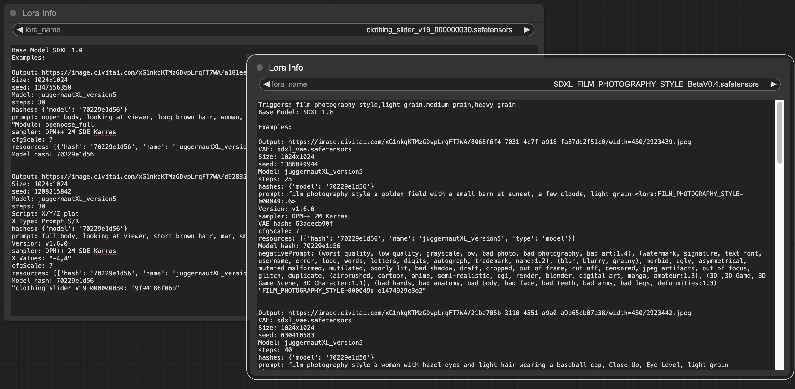

## Lora Info

Shows Lora Base Model, Trigger Words and Examples

Special thanks to:

- `badjeff` for doing all the actual hard work (https://github.com/badjeff/comfyui_lora_tag_loader)
- `alessandroperilli` for all the feedback.



## Installation

Inside ComfyUI/custom-nodes

```sh
git clone https://github.com/jitcoder/lora-info.git
```

Or download this repo as a zip and extract in the custom-nodes directory.

Restart ComfyUI

