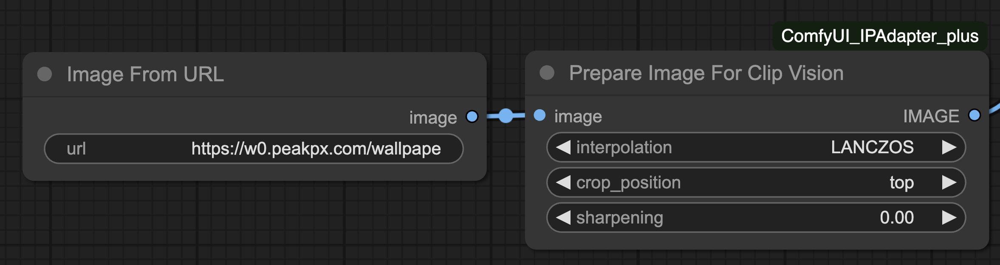

# Contains 2 Nodes
- Lora Info
- Image From URL

Apologies for shoving another node into this repo, I'll eventually create a new repo for the Image From URL 

## Installation

#### Method 1. 
Open ComfyUI Manager, search for "lorainfo", or "jitcoder", click install

#### Method 2.

Inside ComfyUI/custom-nodes

```sh
git clone https://github.com/jitcoder/lora-info.git
```

#### Method 3.

Download this repo as a zip and extract in the custom-nodes directory.


## Lora Info

Shows Lora Base Model, Trigger Words and Examples

Special thanks to:

- `badjeff` for doing all the actual hard work (https://github.com/badjeff/comfyui_lora_tag_loader)
- `alessandroperilli` for all the feedback.


## Image From URL

Loads an image from the URL and makes it available for use in your workflow. This is especially useful if you intend on 
sharing your workflows and want to make it easier for users to use them instead of having to download images separately.


